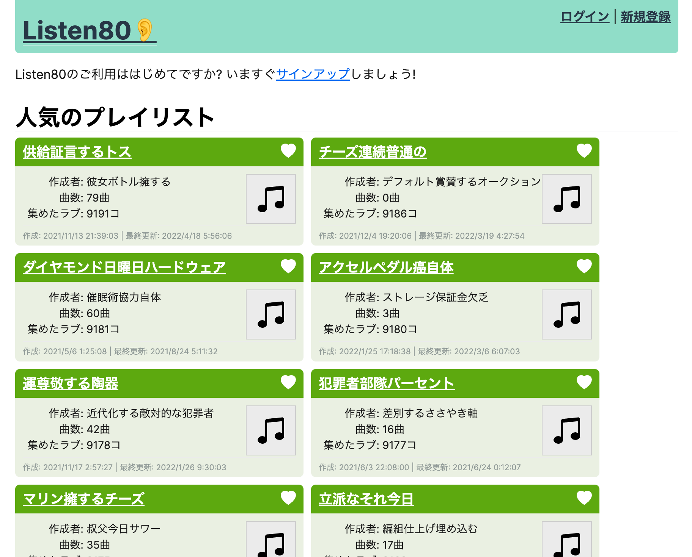

# 社内ISUCON 2022

面白法人カヤックの社内ISUCON2022年版です。



## 用意されている参考実装

- Node.JS (TypeScript)
- Go

## レギュレーション & 当日マニュアル

[docs/README.md](docs/README.md)

## 起動方法

### ローカル + Docker Compose

```console
$ git clone https://github.com/kayac/kayac-isucon-2022.git
$ make dataset
$ cd webapp
$ docker compose up --build
```

初期状態では Node.JS (TypeScript) 実装が起動します。Go実装に切り替える場合は docker-compose.yml のコメントを参照。

初回起動時にはMySQLへデータを読み込むため、起動まで数分かかります。
Go実装は初回起動時にMySQLに繋げずに終了してしまうことがあります。MySQLが起動後、Docker Composeを再起動して下さい。

マニュアル [docs/README.md](docs/README.md) も参照して下さい。

### EC2 AMI

AWS ap-northeast-1 (東京リージョン)ami-xxxxxxxxx でEC2を起動する。

- TCP port 80 (必要なら22) を適宜開放する
- インスタンスタイプ c6i.xlarge
  - 社内ISUCON開催時のスペック。2コアでも動作するはず
- isucon ユーザーが存在する
- `/home/isucon` 以下にアプリケーションが配置されている
- Docker Compose でアプリケーション一式が起動している

マニュアル [docs/README.md](docs/README.md) も参照して下さい。

## ベンチマーク実行方法

### ローカル

Go 1.18 でビルドして下さい。「起動方法 > ローカル + Docker Compose」の `make dataset` を事前に実行して下さい。

```console
$ cd bench
$ make bench
```

### 実行方法 (ローカル, EC2 共通)

```console
$ cd bench
$ ./bench

(略)
17:42:27.650368 SCORE: 600 (+610 -10)
17:42:27.650445 RESULT: score.ScoreTable{"GET /api/playlist/{}":221, "GET /api/playlists":13, "GET /api/popular_playlists":1, "GET /api/popular_playlists (login)":1, "GET /api/recent_playlists":13, "GET /api/recent_playlists (login)":11, "POST /api/login":33, "POST /api/playlist/favorite":175, "POST /api/playlist/{}/add":4, "POST /api/playlist/{}/update":3}
```

出力される `SCORE: 600` が最終的なスコアです。(+が得点 -がエラーによる減点)

### オプション

```
Usage of ./bench:
  -data-dir string
        Data directory (default "data")
  -debug
        Debug mode
  -duration duration
        Benchmark duration (default 1m0s)
  -exit-error-on-fail
        Exit error on fail (default true)
  -initialize-request-timeout duration
        Initialize request timeout (default 30s)
  -prepare-only
        Prepare only
  -request-timeout duration
        Default request timeout (default 15s)
  -skip-prepare
        Skip prepare
  -target-url string
        Benchmark target URL (default "http://localhost")
```

別のホストからベンチマークを実行する場合、`-target-url` を指定して下さい

## LICENSE

MIT
